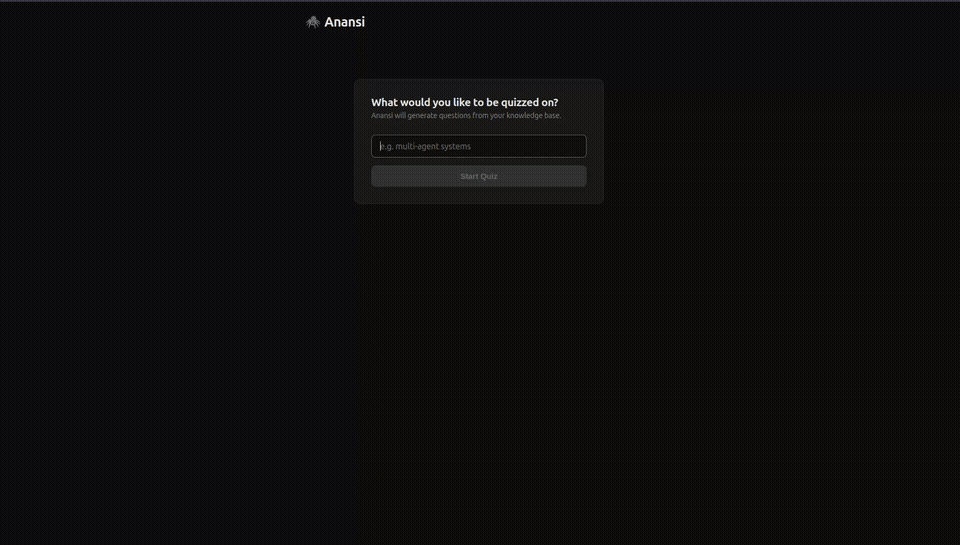

# Anansi

In West African folklore, Anansi is a spider — keeper of all stories, font of wisdom, and a trickster who demands proof of understanding from those who seek knowledge. This project takes that name: an adversarial examiner that challenges you to prove mastery of your own material. A rite of passage between you and the knowledge you claim to hold.

Built as an extension of [Karpathy's LLM wiki pattern](https://gist.github.com/karpathy/442a6bf555914893e9891c11519de94f), Anansi adds an active learning loop: it quizzes you on the material in your wiki and evaluates your answers.

## How it works

You supply a topic. A LangGraph pipeline of agents handles the rest:

1. **Selector** — matches your request to a concept in your index file and loads the relevant wiki page
2. **Planner** — uses extended thinking to outline 3–5 questions based on the material
3. **Generator** — turns each outline into a full question (free-answer or MCQ depending on the plan)
4. **Interviewer** — presents each question and collects your answers (terminal or browser)
5. **Evaluator** — scores each answer in parallel using extended thinking, with written feedback
6. **Collector** — aggregates results into a final score

Results persist to PostgreSQL, tracking rolling per-concept scores via exponential moving average.

## Tech stack

**Backend**
- **Python 3.12**, [`uv`](https://github.com/astral-sh/uv) for package management
- **LangGraph** — agent orchestration and state management
- **LangChain** — provider-agnostic LLM support (Anthropic, OpenAI, Ollama); configured via `agent_config.json`
- **FastAPI** — REST API server for the web UI
- **PostgreSQL 16** — learner progress tracking (via Docker)
- **LangSmith** — optional tracing

**Frontend**
- **React 19** + **TypeScript**, bundled with **Vite**
- No UI framework — plain CSS with a dark theme

## Setup

### Backend

```bash
# Install Python dependencies
uv sync

# Start PostgreSQL
docker-compose up -d

# Configure environment
cp .env.example .env
# Fill in the API key for your chosen provider:
#   Anthropic → ANTHROPIC_API_KEY
#   OpenAI    → OPENAI_API_KEY
#   Ollama    → no key needed
# Optional: LANGSMITH_API_KEY for tracing
#
# Required: point the agent at your own wiki and index files:
#   WIKI_PATH  → path to the directory containing your wiki markdown files
#   INDEX_PATH → path to your index JSON file (concept registry)

# Configure LLM provider and model
# Edit agent_config.json — set "provider", "api_key_env", and "model" in each profile
# Supported providers: anthropic, openai, ollama
```

### Frontend

```bash
cd frontend
npm install
```

## Running

### CLI

```bash
uv run python -m agent.main
```

You'll be prompted: `What would you like to be quizzed on?` — answer in the terminal, get results in the terminal.

### Web UI

Start both servers:

```bash
# Terminal 1 — API server
uv run uvicorn app.server:app --reload

# Terminal 2 — Frontend
cd frontend && npm run dev
```

Then open **http://localhost:5173**.

The Vite dev server proxies all `/api/*` requests to the FastAPI backend on port 8000, so no CORS configuration is needed in development.



## Question types

| Type | Description | Scoring |
|---|---|---|
| **Free answer** | Open-ended — type a full response | LLM-graded 0.0–1.0 with written feedback |
| **MCQ** | Four lettered options (A/B/C/D) | Exact match, 1.0 or 0.0 |

The planner chooses the type per question: MCQ for factual/recall, free answer for anything requiring explanation or analysis. A quiz typically contains a mix of both.

## Project structure

```
anansi/
├── agent_config.json         # LLM provider + model config
├── docker-compose.yml        # PostgreSQL service
│
├── agent/                    # Core pipeline
│   ├── main.py               # LangGraph graph definitions & run_quiz() (CLI entry)
│   ├── llm_factory.py        # Provider factory (Anthropic, OpenAI, Ollama)
│   ├── state.py              # AgentState + QuizQuestion schemas
│   ├── db.py                 # Persistence logic
│   ├── nodes/
│   │   ├── selector.py       # Topic → concept matching
│   │   ├── planner.py        # Quiz plan (extended thinking)
│   │   ├── generator.py      # Question generation
│   │   ├── interviewer.py    # Interactive CLI answer collection
│   │   ├── evaluator.py      # Parallel scoring (extended thinking)
│   │   └── persister.py      # DB writes (currently disabled)
│   └── tools/
│       └── file_loader.py    # Markdown file reader
│
├── app/                      # Web API
│   ├── server.py             # FastAPI routes (/api/quiz/start, /api/quiz/submit)
│   └── session.py            # In-memory quiz session store
│
├── frontend/                 # React + TypeScript + Vite
│   └── src/
│       ├── App.tsx           # Stage machine (topic → quiz → results)
│       ├── api.ts            # Fetch wrappers for the FastAPI backend
│       ├── types.ts          # Shared TypeScript types
│       └── components/
│           ├── TopicForm     # Topic input
│           ├── QuizView      # Question-by-question quiz with bubble nav
│           └── Results       # Score summary + per-question feedback
│
└── db/
    └── init.sql              # Schema: quiz_attempts + concept_profile
```

## Adding content

Anansi is read-only with respect to your wiki — it loads your files to generate questions but never writes to them. You manage the wiki and index yourself, or with your own tooling (Claude Code, Codex, etc.).

- **`INDEX_PATH`** — a JSON file with a `concepts` array. Each entry has four fields:

  | Field | Purpose |
  |---|---|
  | `id` | Unique identifier used to match quiz requests |
  | `file` | The markdown filename in `WIKI_PATH` |
  | `description` | What the selector reads to route requests — write it to capture the key terms someone would use |
  | `tags` | Additional keywords to aid matching |

- **`WIKI_PATH`** — a directory of markdown files; each file's name corresponds to the `file` field of its index entry

To add a new topic, update your wiki and index directly — Anansi picks it up on the next run.
